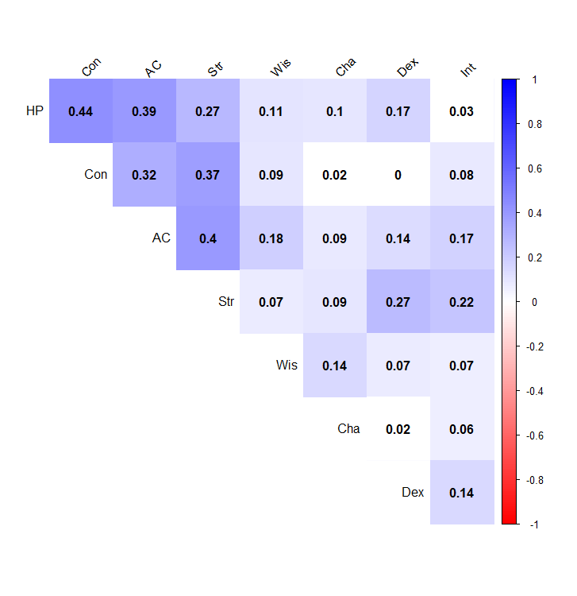
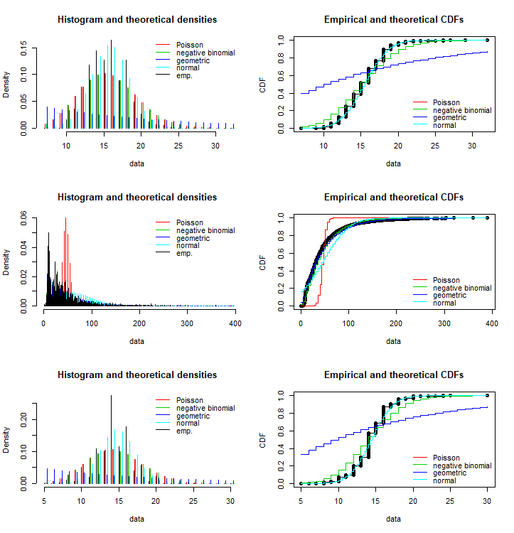
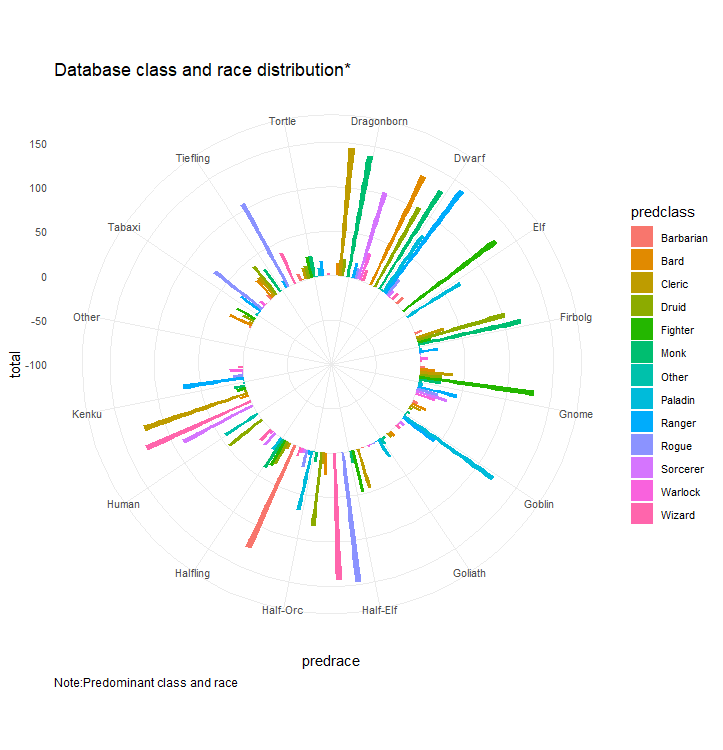
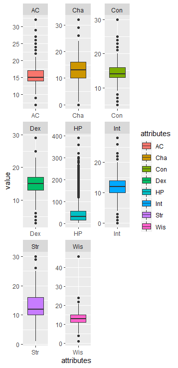
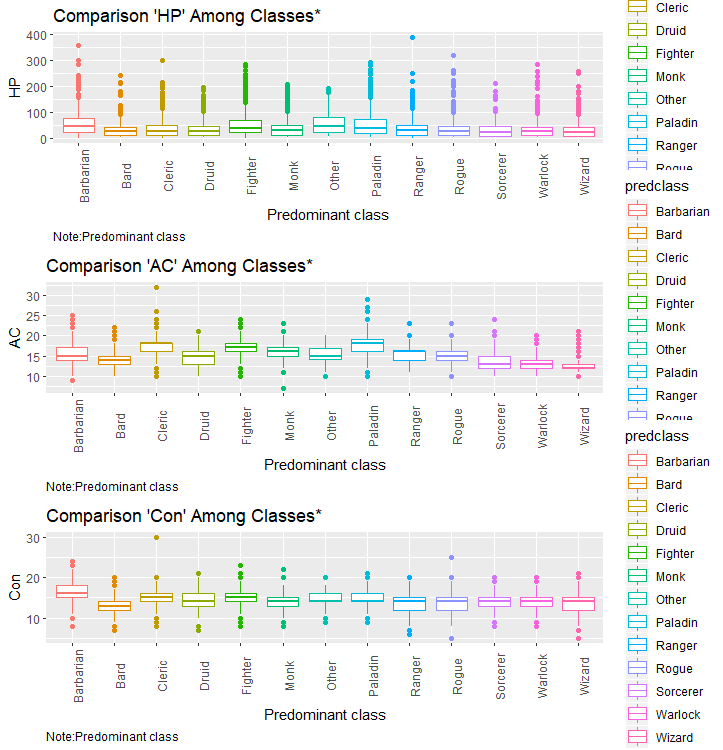
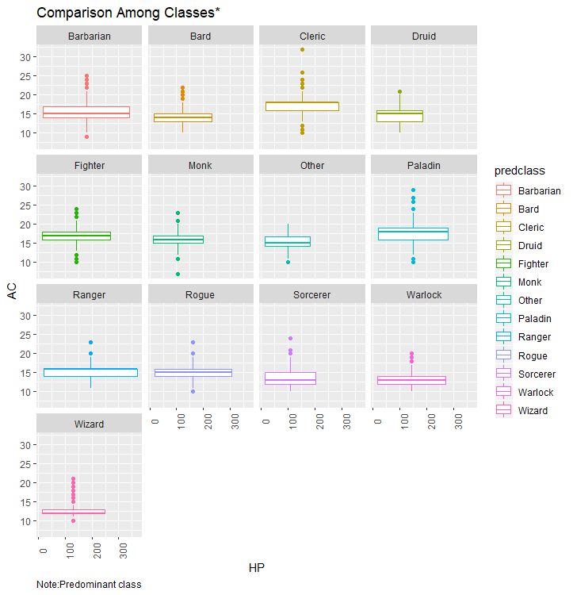
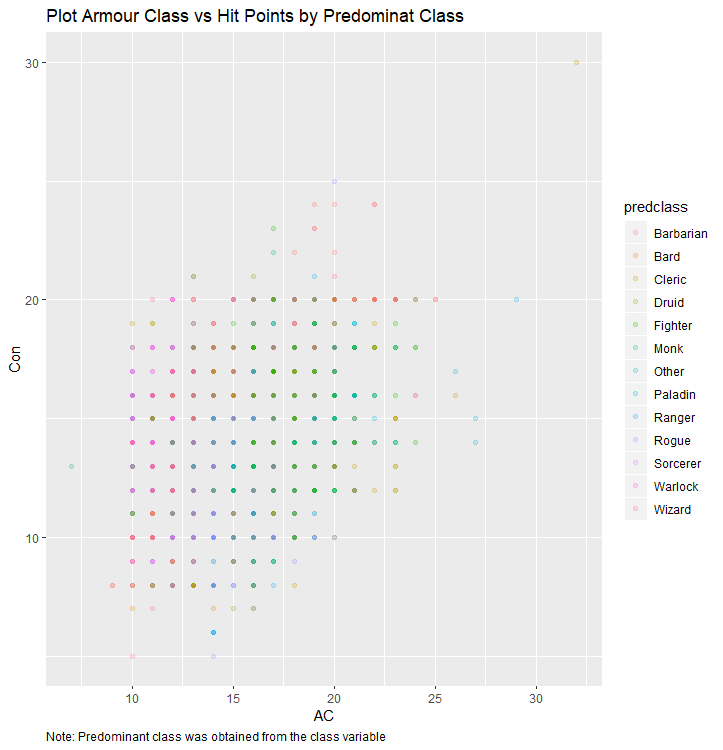
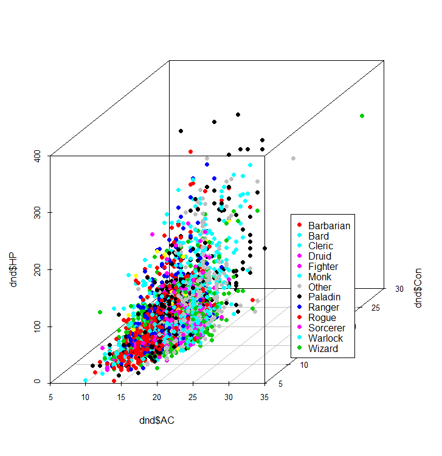
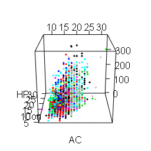
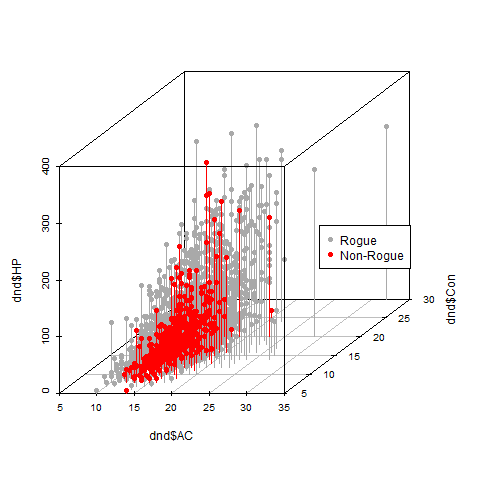

## D&D - Exploratory Data Analysis

This analysis was built on a database already established by [Burak Ogan](https://github.com/oganm/dnddata). There is already a previous analysis over this same database built by [Jacob Soderlund in displayr](https://www.displayr.com/dungeons-and-data-science/) so in this one i tried to not to repeated what he had done before and instead to give extra insigths over the classes with focus on the visualizations.

Before going into the details of the analysis here is a quick introduction. 

D&D is a rolling dice game that works usually based on a set of 7 dice (d4,d6,d8,d10,d12,d20 and another d10). Dice play an important role in the game and they are all used with different aims. For example a d20 is usually used in attacks while d4,d6,d8,d10 or d12 are used for weapons damage depending on the weapon,character and a few other variables. But also dice are also used when setting the scores of a character.

This makes the data that we are gonna be analyzing random and discrete by definition due to it is obtained thorugh calculations based on rolling a dice and therefore even when in this sample of data that will be analyzing may show some patterns this doesnt mean that this patterns are set for being repeated in other samples. And that is one of the best and most interesting characteristics of DnD.

Every DnD character is unique in their own way, there are different classes and races that you can choose from and basically the player is the one who can make the most out the character skills(read: ability scores). Players can decide to choose between predefined characters or create their own. When creating a new character one chooses the class and rolls the dice to define the different abilities with also adding bonuses or substracting penalizares when required (this changes depending on the class). Similarly, other feature like healt points (HP), Armour class (AC) and others are defined using dice rolling and bonuses noted in the player handbook.

### 1. Distribution numeric variables

#### 1.1 Numeric variables histogram
Using dplyr,tidyr and ggplot2 a histogram for all the numeric variables of the dataset was created.

This is a really good mix because while ggplot2 offers a powerful graphics language, tidyverse allows us to process the data and dplyr allows us to use a pipe operator %>% to connect data operations from left to rigth instead of creating intermediate objects.

```{r}
dnd %>%
  gather(attributes, value,2:9) %>%
  ggplot(aes(x = value)) +
  geom_histogram(aes(fill=attributes)) +
  facet_wrap(~attributes, scales = 'free_x') +
  labs(x="Values", y="Frequency", title="Distribution numeric variables") 
```


#### 1.2 Correlation graph

A correlogram was done to measure if there was any degree of correlation between the variables. This showed that all variables have a positive correlation between each other but the strength of the relationship is not even moderate positive 0.6. 

```{r}
corrplot(abs(cor(dnd[,2:9])), method="color", col=colorRampPalette(c("red","white","blue")) (200), 
         type="upper", order="hclust", 
         addCoef.col = "black",
         tl.col="black", tl.srt=45,   p.mat = p.mat, sig.level = 0.01, insig = "blank", diag=FALSE 
)
```


#### 1.3 Fitting 

Even when for this case we are just handling discrete variables it seemed to me as a good idea to showcase how to identify the distribution of a dataset. 

For this the [fitdistrplus](https://cran.r-project.org/web/packages/fitdistrplus/fitdistrplus.pdf) package was chosen. The fitdistr function in this package allow us to estimate distribution parameters by maximizing the likelihood function.

Due to are stats are obtained from rolling dice it makes sense that they tend to a normal distribution following the central limit theorem.

```{r}
fp <- fitdist(dnd$AC, "pois",discrete=TRUE)
fnb <- fitdist(dnd$AC, "nbinom",discrete=TRUE)
fg <- fitdist(dnd$AC, "geom",discrete=TRUE)
fn <- fitdist(dnd$AC, "norm",discrete=TRUE)

denscomp(list(fp,fnb,fg,fn),legendtext = c("Poisson", "negative binomial","geometric","normal"), fitlty = 1)
cdfcomp(list(fp,fnb,fg,fn),legendtext = c("Poisson", "negative binomial","geometric","normal"), fitlty = 1)
```


### 2. Classes and Races

The initial data set had 768 classes and 182 races which were reduced into 13 predominant classes and 16 predominant races for faciliting data visualization and manipulation.

#### 2.1 Circular plot

For this we will keep using ggplot2 along with tidyverse and dplyr as we did before but we will include this time polar coordinates so we can make it into a circular barplot. Which to me is a nice way of displaying the information between classes and races.

```{}
dnd_bar <- dnd %>%
  select(name,predrace,predclass) %>%
  add_count(name) %>%
  group_by(predrace,predclass) %>%
  summarise(total = sum(n)) 

ggplot(dnd_bar, aes(x=predrace, y=total,fill=predclass)) + 
  geom_bar(stat="identity",position="dodge") +
  ggtitle("Database class and race distribution*")+
  labs(caption="Note:Predominant class and race")+
  ylim(-100,150) +
  theme_minimal() +
  theme(
    axis.text=element_text(size=8),
    legend.text=element_text(size=8),
    plot.caption = element_text(hjust = 0)
  ) +
  coord_polar(start = 0)
```



#### 2.2 Boxplot to display variability

Boxplot diagrams work like a really good way of describing the centre and spread of a distribution.

Keeping with the same libraries we can make a boxplot by individual variable.
```{r}
dnd %>%
  gather(attributes, value,2:9) %>%
  ggplot(aes(x=attributes, y=value)) + 
  geom_boxplot(aes(fill=attributes))+ facet_wrap( ~ attributes, scales="free")
```


And then we can replicate the exercise by groups or predominat classes for the main variables: AC,HP and Con.

```{r}
ggplot(dnd, aes(y =HP, x = predclass, color = predclass)) + xlab("Predominant class") + ylab("HP") + ggtitle("Comparison HP Among Classes*") + geom_boxplot() + labs(caption="Note:Predominant class") + theme(axis.text.x = element_text(angle = 90),plot.caption = element_text(hjust = 0))

ggplot(dnd, aes(y =AC, x = predclass, color = predclass)) + xlab("Predominant class") + ylab("AC") + ggtitle("Comparison AC Among Classes*") + geom_boxplot() + labs(caption="Note:Predominant class") + theme(axis.text.x = element_text(angle = 90),plot.caption = element_text(hjust = 0))

ggplot(dnd, aes(y =Con, x = predclass, color = predclass)) + xlab("Predominant class") + ylab("Con") + ggtitle("Comparison Con Among Classes*") + geom_boxplot() + labs(caption="Note:Predominant class") + theme(axis.text.x = element_text(angle = 90),plot.caption = element_text(hjust = 0))
```


Lastly I thought it would be good to bring out the facet wrap functionality of ggplot which is really useful when you want to do split up your data by one or more variables(groups or classes in our case) and plot the subsets of data together. 

```{r}
ggplot(dnd, aes(y = AC, x = HP,color=predclass)) + xlab("HP") + ylab("AC") + ggtitle(paste0("Comparison Among Classes*")) + geom_boxplot() + labs(caption="Note:Predominant class") + theme(axis.text.x = element_text(angle = 90),plot.caption = element_text(hjust = 0))+ facet_wrap(~predclass)
```


#### 3D scatter plot

Finally even when 3D plotting is just advise when we have actual 3D objects or data mapped onto them. I think for this specific case where we have multiple variables it makes sense to have a 3D plotting due to in a 2D many of the points could be overlayed making it loose perspective.

To show this i will have the 2D plot OF Con vs AC with ggplot and a 3D one of AC, Con and HP with scatterplot3d which allows us to plot a three dimensional (3D) point cloud.

```{r}
twod<-ggplot(dnd, aes(x = AC, y = Con, color = predclass)) + geom_point(alpha = 0.2) + labs( title = "Plot Armour Class vs Hit Points by Predominat Class", caption="Note: Predominant class was obtained from the class variable")+ theme(plot.caption = element_text(hjust = 0))
twod

library(scatterplot3d)
threed<-scatterplot3d(x =dnd$AC, y = dnd$Con, z = dnd$HP, color = as.numeric(dnd$predclass),pch=16,angle=30)
threed
legend(threed$xyz.convert(41, 3, 310),legend = levels(dnd$predclass), col = as.numeric(dnd$predclass), pch = 16)
```



Finally we will use the rgl and magick packges to create animations out of the 3d scatter plots. 

For rgl Movie3d calls a function in a repeated way recording each frame into a movie and Play3d only works for displaying the visualization into R. In this case the function to be passed to R is spin3d. For our case with are setting the speed rotation per minute rpm in 5.

rgl has a bit of a trouble when you have several classes and try to include them in the legend because it has a 2D legend in the back part of the graph so that's why i left it as no-legend.

```{r}
require(rgl)
with(dnd,plot3d(AC,Con,HP,col=as.integer(predclass),xlab="AC",ylab="Con",zlab="HP",box=TRUE,type="p"))
#legend3d("center", levels(dnd$predclass), col = as.numeric(dnd$predclass), pch = c(1, 16))

movie3d(spin3d(axis = c(0, 0, 1),rpm=5), duration = 5,type="gif",dir=".",movie="Scatterplot3d")

if (!rgl.useNULL())
  play3d(spin3d(axis = c(0, 0, 1), rpm = 5), duration = 5)
```


With magick what we did was creating a png by class in a loop using the scatterplot3d function with the addition of some overlaying points using the points3d function and then joining them into a gif using the image_join function of magick. 

```{r}
library(magick)

labels<-as.character(unique(dnd$predclass))
frames <- length(labels)

for (i in 1:frames) {
  name<- paste('00',i,'plot.png', sep='')
  png(name)
  plot.new()
  sp3d<-scatterplot3d(x =dnd$AC, y = dnd$Con, z = dnd$HP, color="darkgrey", type="h",pch=16,angle=30)
  sp3d
  sp3d$points3d(dnd[dnd$predclass==labels[i],c("AC")],dnd[dnd$predclass==labels[i],c("Con")],dnd[dnd$predclass==labels[i],c("HP")],col="red", type="h", pch=16)
  legend(sp3d$xyz.convert(41, 3, 310),legend =c(labels[i],paste0("Non-",labels[i])), col =c("darkgrey","red"), pch = 16)
  dev.off()
}

list.files(path=".", pattern = '*.png', full.names = TRUE) %>% 
  image_read() %>% 
  image_join() %>% 
  image_animate(fps=4) %>% 
  image_write("dnd_classes.gif") 
```


So that is all from a board game enthusiast. I hope the analysis have been fun to read how it was to write. I think is always fun to find how to apply stats in daily life things specially if is something you like as board games and it is always refreshing to see something in a non-traditional approach.

## Prerequisites

* R (Packages: ggplot2,tidyr,dplyr,corrplot,fitdistrplus,ggpubr,scatterplot3d,rgl,magick)

## Author

**Lina Berbesi** (https://github.com/strmtrooper)

## License

Licence: this work is released under Creative Common Attribution 4.0.

<a rel="license" href="http://creativecommons.org/licenses/by/4.0/"></a>
 
## Acknowledgments

* Burak Ogan Mancarcı (https://github.com/oganm/dnddata)

